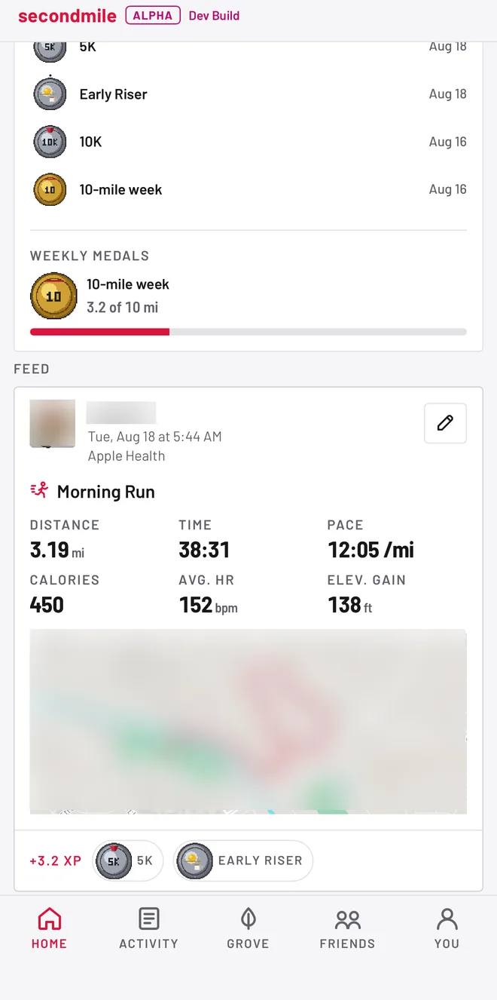
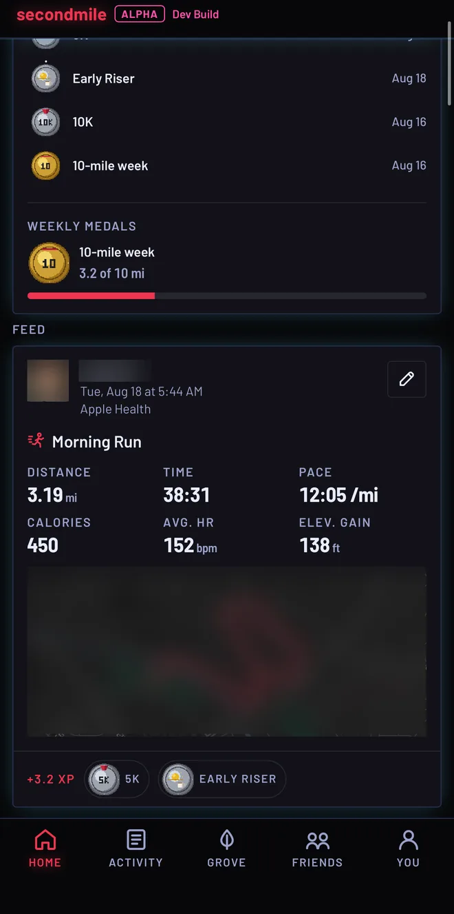
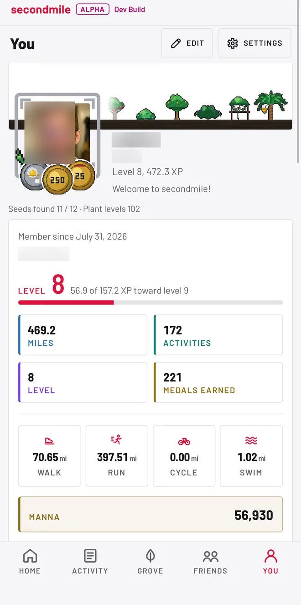
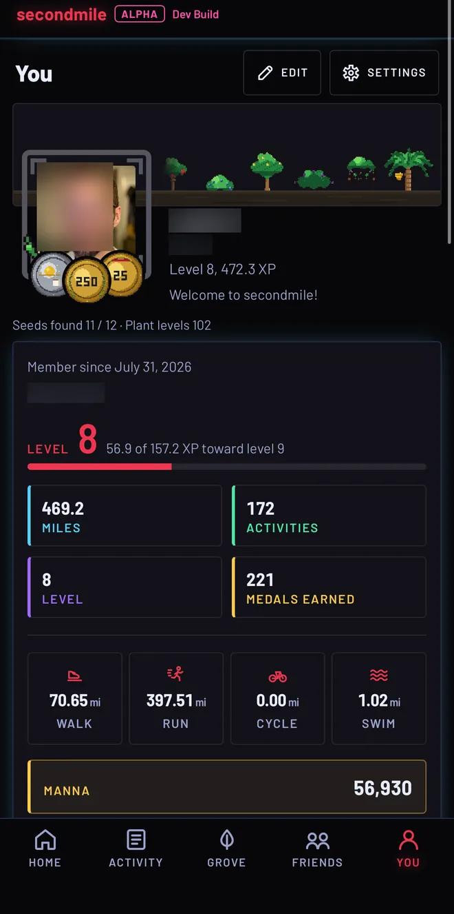
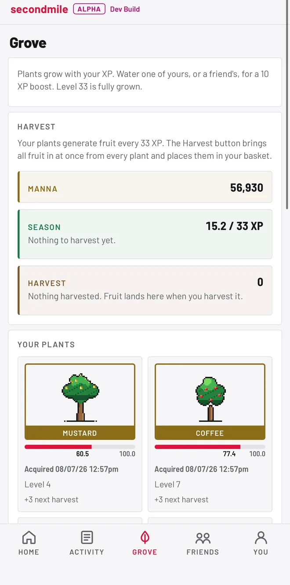
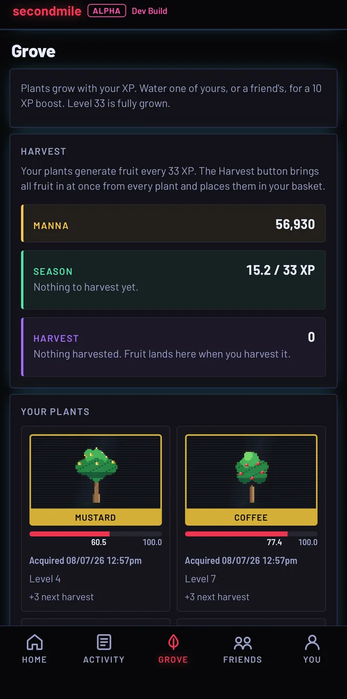
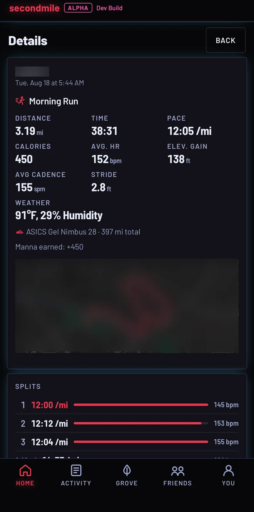

# secondmile

A self-hosted fitness app with a game inside it. Miles you actually walk, run,
cycle, or swim sync from your phone and become experience, medals, and things
growing in a grove on a profile you build over months. The game is early:
accounts, workout sync, the Activity tab, the profile with its levels and
medals, the grove with its chests, seeds, and pets, the screen behind a single workout,
and a feed shared with friends all work today, and the rest is being built on top
of them. The app says so rather than hiding it: there is an alpha chip in the
top bar and a line at the foot of every page, and most of the artwork is
placeholder.

Current version: **0.2.1**. Releases are tagged in git, and each tag's GitHub
release carries the notes for it.

## Screenshots

| Home, light | Home, dark | You, light | You, arcade |
| --- | --- | --- | --- |
|  |  |  |  |

| Grove, light | Grove, arcade | Workout details, arcade |
| --- | --- | --- |
|  |  |  |

These are real screens from a running instance, so the personal details in them
are blurred: names, faces, and the maps under the routes.

## Features

### The feed, and encouraging people

- **Keeps a small circle.** An instance is a private club rather than a general
  app: everybody on it was invited by somebody, so members can look each other
  up by name and see a card with a face, a bio, and the month they joined, and
  nothing else without a friendship. Friends are mutual, there are no
  suggestions, and no count of anybody's friends. The home
  feed carries your workouts and your friends', and never anybody else's. A
  friend's card shows the whole
  workout: the distance, the time, the pace, the calories, the heart rate, the
  climb, the medal, and the route line. A workout carries what you took of it as
  well: up to six photos and videos between them, one of which may be a video of
  about a minute, re-encoded by the server so nothing keeps the camera, the
  date, or the place it was shot in. Tapping a route line opens it on a map
  your own server draws, from a tile archive you install or do without. Settings has
  switches for the heart rate, the
  calories, and the route, and anything switched off is left out of what the
  server sends rather than hidden by the app. You can hype a workout without
  words or write a comment on it, and
  nothing in the app ever suggests what to say. Comments sit on the workout
  they were written about: anyone who can see the workout can read them, and
  only the owner's friends can write one.
- **Keeps score of encouragement, and of nothing else.** Hyping a workout,
  writing a comment, watering a friend's plant, spending a boost potion on them,
  feeding their grove, and handing over manna or fruit all earn renown. No screen
  and no API response ever carries the number: it shows up as growth wrapped
  around your avatar border, in three stages, and nowhere else. Inside a week one
  pair earns once per kind, so two accounts hyping each other all evening earn
  one hype's worth between them. Everything after still arrives and is still
  worth as much to whoever receives it; it just pays the sender nothing.
- **Writes you a letter once a week.** A short recap in plain sentences: what
  you covered, what grew and bore, who arrived in the grove, and what friends
  sent. It reads in under a minute, and it is the only digest there is.

### The earning lane

- **Syncs your workouts.** An ingest endpoint accepts workout exports from
  Health Auto Export on iPhone: walking, running, cycling, and swimming, with
  distance, duration, active calories, and average heart rate. Syncing is
  idempotent, so overlapping export windows never double-count a workout.
  Syncing is the only way a workout arrives, so there is one way in and every
  row can say where it came from.
- **Counts steps without paying for them.** A second, optional export brings in
  your daily step count and your walking and running distance. Steps are shown
  on your profile and in the tally on the landing page, and they earn nothing at
  all: no experience, no level, no chest, no growth, no medal.
- **Keeps the Activity tab.** A history of everything you have done, grouped by
  week, with totals per activity. Workouts with impossible numbers (a four
  minute mile, a fifty mile walk) are imported but flagged rather than
  trusted.
- **Tracks the shoes.** Add a pair on your profile and pick it on a workout,
  and the miles add up on that pair until you retire it.
- **Turns those miles into a profile.** Experience is the distance itself, and
  each activity converts at its own rate, so an hour in the pool is not an hour
  on a bike and a swimmer is never shortchanged. The levels are the race
  ladder: a 5K, then a 10K, then a half, then a marathon, and a marathon more
  every level after that. Levels grow the border around your picture, and the
  medals you have chosen sit in fixed slots around it. Weekly and lifetime
  totals are worn on the profile. There are no leaderboards of raw miles and
  there never will be: profiles celebrate, they do not rank.
- **Keeps an endless list of things to earn.** Thirty-two medals in eight
  families: seven for a single walk or run that covers a mile, two miles, 5K,
  10K, half marathon, marathon, or 50K, four for a big week, two for setting out
  between four and six in the morning or after eight at night, four for a long
  ride, three for a long swim, and then three lifetime ladders of four rungs
  each, one for every mile covered, one for every mile ridden, and one for every
  mile swum. Every threshold is raw miles on the ground rather than converted
  ones. Feet are feet, so a walk earns at every distance a run does. All but the twelve
  lifetime medals repeat, and each is counted on the profile, so a medal earned
  five times says so; every fifty of the same one adds a star, up to thirty
  three.
- **Drops chests on a ladder you can count.** Chests cost 5K, then 10K, then a
  half, a marathon, an ultra, and then the ladder starts again. Converted miles
  from every activity are the fuel, a long run climbs several steps at once,
  what is left over carries, and nothing ever expires or decays.

### The grove

- **Fills a grove rather than an album.** Every chest holds one of four things,
  and all four are tools: a seed to plant, water to pour into one plant, a boost
  potion to spend on a friend, or an unmarked seed you turn into any species you
  have not found yet. Plantings grow from every workout you log, all of them at
  once, with nothing to tend and no timers; swimming brings extra water.
  Everything levels on the XP your miles convert to, is grown at level one, and
  is fully grown at the last one. Nothing can wither and nothing can be bought.
- **Bears fruit, and turns calories into manna.** A grown plant bears fruit as
  the converted miles add up, every plant at once, and one button brings the lot
  in. The active calories in a workout become manna, which either feeds a plant
  for a richer harvest, yours or a friend's, or is handed to a friend as it is.
  Manna never buys growth, and gathered fruit is only ever something to give
  away.
- **Gives you something to give away.** Water can be poured into a friend's
  grove as easily as your own. A boost potion is encouragement rather than a
  secret: spend it on a friend and their own screen says the next chest their
  miles were already going to earn opens a step rarer, with your name on it.
- **Draws animals in, after the harvest.** The first gather is followed home by
  a stray, one of six species, leaning toward the hours you tend to move in.
  Fruit fed to it grows it through three drawings, and grown it stays for good,
  which is when the next stray finds you. A pet confers nothing at all, no
  yield and no odds: it is presence, a name if you give it one, and a heart
  over its head when you pat it.

### One workout, in full

- **Opens the session behind the card.** Tap a card on the feed or a row in the
  Activity tab and the workout opens on a screen of its own. It splits the
  session by mile or kilometre and names the fastest whole one, counts the
  minutes spent in each of the five heart rate zones, and draws the minutes
  themselves as a stack of lanes over one time axis: heart rate, pace, calories,
  and cadence on a walk or a run. Each lane keeps its own scale and they share
  one cursor. Tap a split and it lights up along the route line; drag the cursor
  and a dot walks the same line beside the reading.
- **Says what a card has no room for.** Average cadence and stride length on a
  walk or a run, elevation, the air the session happened in and what it felt like
  when that air was hot, the pair of shoes it was done in with everything they
  have covered, and what the session put in the manna bank. The detail is read
  off the export and shown, and nothing worked out from a workout reads a word of
  it: no level, no chest, no medal, no growth. The manna line reports what the
  session's own calories were already worth.
- **Keeps the owner's switches all the way down.** The heart rate switch takes
  the per-minute beats, the session's highest, and the zones with it; the
  calories switch takes the per-minute calories; the route switch takes the climb
  along with the line. Your own copy always carries everything, because hiding a
  number from yourself is not a privacy setting.

### Appearances

- **Three of them, per device.** Light, Dark, and Arcade. The switch is in
  Settings, and the browser remembers it rather than the account: a phone in bed
  and a desktop by a window are not the same room. The landing page and an invite
  link carry the same switch, so the first screen anybody sees is already on the
  ground they picked.
- **The artwork is placeholder, and every piece is swappable.** The grove plants,
  the pets, the medal faces, the growth around a border, and the things in the inventory
  are 48 by 48 pixel art; the avatar borders, the soil, and the gilding are still
  SVG. Each is a file addressed by name, so replacing one is dropping a file in
  and rebuilding, with no code to edit. See
  [docs/03-artwork.md](docs/03-artwork.md).

### Running it for other people

- **Multi-user from day one.** Accounts are invite-only out of the box: the
  server admin creates invites from the command line, and any member can mint a
  single-use invite link from the Friends screen, which opens a welcome page
  naming whoever sent it and makes the two of you friends once it is claimed.
  Flip `REGISTRATION_OPEN` and anyone who can reach the site can sign up
  instead. Either way a new account has to verify its email address before it
  can sign in, and an instance with no mail server configured writes the
  verification link to the backend log instead of sending it.
- **Installs on a phone, and says when a sync lands.** The app installs to a
  Home Screen as a web app, and one notification goes out when a sync brings new
  workouts. The push is your own server's: it stays off until the server is
  given a VAPID keypair, and then each person turns on the devices they want it
  on. An iPhone needs the site on its Home Screen first, which is the platform's
  rule rather than this app's.
- **Explains the phone side inside the app.** Settings opens a setup guide with
  screenshots, naming every field the export app asks for and what to set it to.
- **Takes bug reports from inside the app.** The bottom of Settings has a box
  that sends what went wrong, along with the screen it happened on, straight to
  whoever runs the instance.

## Where it is going

The synced miles are the fuel for a game in active development. The short
version of the design:

- Each activity has its own role, and no activity substitutes for another.
- The economy is built so that giving feels better than keeping. Serving
  others is meant to be the winning strategy, and the best things in the
  game will be earned by service, not bought.
- Rest is part of the design, not a failure state. Nothing breaks because
  you took a day off, and nothing rewards you for opening the app. Everything
  accrues while you are away.

The name comes from an old teaching about going farther than you were asked
to. The game never explains it, and neither will I.

## How it fits together

```
iPhone  (Health Auto Export)   ---.
Android (Health Connect bridge) --+-- POST /api/ingest --.
                                                         |
browser --- your reverse proxy (HTTPS) --- [ frontend nginx :8110 ]
                                                         |
                                              /api proxied to
                                                         |
                                                [ backend FastAPI ]
                                                         |
                                                  [ PostgreSQL ]
```

The compose file publishes two localhost-only ports: 8110 for the app and
8100 for the raw API. Nothing listens on the LAN or the internet until you
put your own reverse proxy in front of it.

### The path a workout takes

One endpoint accepts a sync, and everything after it is a straight line. It is
worth reading in order, because most of the design lives in where the seams are
rather than in any one file.

1. `routers/ingest.py` authenticates a bearer token, refuses an oversized body,
   and hands the payload on. If the payload is one the Apple reader cannot
   understand, `healthconnect.py` translates it into the shape that reader
   expects. That module is the only part of the codebase that knows Android
   exists.
2. `activity.py` turns entries into `ParsedWorkout` values: which of the four
   activities a name means, its numbers converted into miles and kilocalories
   from whatever units the phone's locale chose, and which soft flags it earns.
   Anything it cannot read is refused by name rather than guessed at, and the
   refusals go to the ingest log so a failing sync can be diagnosed after the
   fact.
3. Each workout is inserted inside its own savepoint. A duplicate raises against
   a unique key on (owner, start, duration) and rolls back only that row, so one
   already-known workout in a thousand does not abort the export. This is the
   common case, not the edge case: every overlapping sync window is full of them.
4. `samples.py` reads the per-minute detail off the entry, `routemaps.py` draws
   the GPS trace and trims both ends of it before storing, and the raw trace is
   stripped from the payload before the payload is logged.
5. `progress.py` credits what arrived: experience, levels, medals, chests, and
   growth in the grove. It credits only workouts that carry no marker row yet, so
   running it twice cannot double-count, and a deleted workout stays uncredited
   because it has no marker standing in for it. `manage.py recompute-progress`
   rebuilds a whole history from the workouts that survive.

### Two rules the code holds to

Anything earned by distance can only ever be earned by distance. Levels, medals,
chests, and how fast a plant grows read miles and nothing else. Calories become
a separate currency that is given away or spent on fruit yield, and it never
touches the earning side. A mechanic that crossed those lanes would be a bug,
not a feature. Pets sit in neither lane: they are presence only and confer
nothing, and a mechanic that read them for a bonus would be the same bug one
lane over.

Rewards come from logging miles, never from opening the app. There are no login
streaks, no countdowns, and nothing expires except the two things meant to be
given away. Time away from the app costs a user nothing.

## Quick start

1. Install Docker with the compose plugin.
2. `cp .env.example .env` and fill in every value. The backend refuses to
   start while any placeholder is left.
3. `docker compose up -d --build`
4. Create your account:

   ```
   docker compose exec backend python manage.py create-admin yourname
   docker compose exec backend python manage.py create-invite
   ```

   The first command prompts for a password and an optional email address,
   and the account it makes is verified already. Invites are one-time codes
   for the registration page; everyone who registers there gets a
   verification link by email before they can sign in.
5. Open http://127.0.0.1:8110, or point your reverse proxy at that port and
   use your own domain.

To see the app with data in it before any real workout has synced:

```
docker compose exec backend python manage.py seed-demo
```

The demo user and its workouts are fictional, and the seeder refuses to run
on a database that already has real accounts.

## Syncing workouts

See [docs/02-health-sync.md](docs/02-health-sync.md). The short version: the
Settings screen gives you a bearer token, and you point an exporter app at
`https://your-domain/api/ingest` with that token in the Authorization header.
On iOS that is Health Auto Export; on Android it is a Health Connect bridge that
can attach a custom header. The server reads either shape, and the in-app setup
guide walks through both.

## Configuration

Everything configurable lives in `.env`, and every variable is documented in
[.env.example](.env.example). Runtime things that are not secrets (units, your
ingest token) live in the app's Settings screen instead of a file.

Two of them decide how people get accounts:

- `REGISTRATION_OPEN` is false by default, which keeps registration to people
  holding an invite code. Set it to true for an instance anyone may join.
- The `SMTP_*` block and `SITE_URL` are how the verification email gets sent
  and where its link points. Leaving `SMTP_HOST` empty is a supported setup,
  not a broken one: see [docs/01-self-hosting.md](docs/01-self-hosting.md) for
  running without a mail server.

## Security model

- Passwords are hashed with Argon2id. Sessions are opaque random tokens
  stored server-side and delivered in an httpOnly, secure, same-site cookie,
  so a leaked database dump does not contain usable sessions.
- Login, registration, ingest, password changes, address changes, and
  verification resends are rate limited per address.
- Changing the address on an account asks for the current password, mails the
  link to the new address, and moves nothing until that link is opened.
- The ingest endpoint authenticates with a per-user bearer token that can be
  rotated from Settings at any time. Tokens are stored hashed.
- Registration is invite-only unless you open it, and either way an account
  cannot sign in until it has answered a verification link. Verification
  tokens are random, stored hashed, good for 24 hours, and spent on first use.
- Registration answers the same way whether it created an account or the
  username or address was already taken, so the form cannot be used to find
  out who has an account here. Sign in gives one message for every kind of
  failure, and the unverified check runs after the password check so it can
  never confirm a password.
- Suspicious workouts are flagged, never silently trusted: impossible paces
  and days that blow past the configured distance caps are marked in the
  Activity tab.
- Uploaded profile pictures are refused above 5 MB before anything decodes
  them, then decoded to prove they really are images, then re-encoded from
  their pixels to a 512 by 512 webp. The original bytes are never stored or
  served, all metadata including location is dropped, and the file name comes
  from the account rather than from the upload.
- Experience, levels, medals, and chest drops are computed on the server from
  synced workouts alone. There is no client input that can grant any of them.
- The containers run unprivileged, base images are digest-pinned, Python
  dependencies are hash-locked, and CI runs a known-vulnerability audit on
  every push.

If you find a security problem, see [SECURITY.md](SECURITY.md).

## Repository layout

```
backend/     FastAPI application, migrations, tests, manage.py CLI
frontend/    Vite + React app, served by nginx in production
docs/        Self-hosting, health sync, and artwork guides
```

The backend keeps its domain in plain modules rather than in the routers:
`activity.py` reads exports, `progress.py` credits them, `grove.py` grows
things, `samples.py` reads per-minute detail, `healthconnect.py` translates
Android exports. Routers stay thin, which is what lets the sync path, the
backfill commands in `manage.py`, and the tests all ask the same questions of
the same code.

## Development

```
cd backend
python -m venv .venv && source .venv/bin/activate
pip install --require-hashes -r requirements.txt
pip install -r requirements-dev.txt
pytest -q

cd frontend
npm ci
npm run dev
```

Tests run against SQLite so they need no running database. CI runs ruff, mypy,
pytest, pip-audit, the frontend lint, typecheck, and build, and npm audit on
every push to main and every pull request.

## License

GNU AGPL-3.0. See [LICENSE](LICENSE). Copyright (c) 2026 Lazarus Labs.

In plain terms: you can run it, change it, and share it, but if you host a
modified version for other people you have to share your changes with them
too. That is the point; this project exists so people can own their own
software.

### Bundled fonts

The interface is set in Barlow and Barlow Semi Condensed, which are licensed
separately under the SIL Open Font License 1.1. The files live in
`frontend/src/assets/fonts/` and the licence travels with them in `OFL.txt` in
that same directory. They are bundled rather than loaded from a font service
because nothing in this app is fetched from another origin, which is also why
the content security policy can say `font-src 'self'`.

## A note on how this was built

This project was built with Claude Code. The code was largely written by the
AI; I specified what it should do, reviewed and corrected it, tested it, and
made the design and operational calls. I run it and I am responsible for it.
